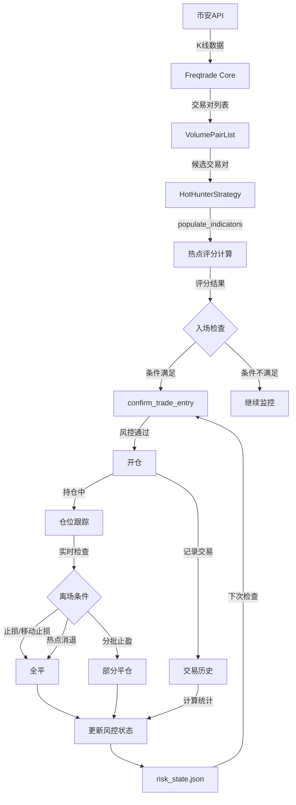
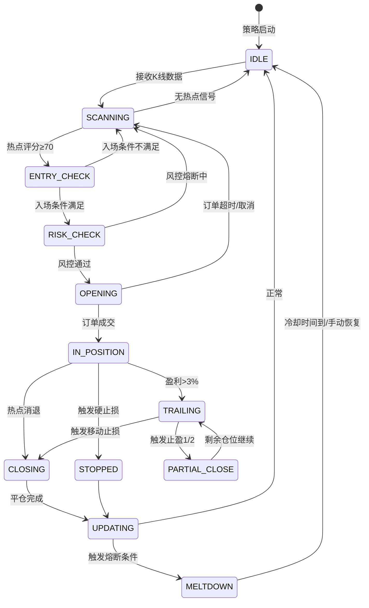

# HotHunter - 币安热点追踪策略架构设计

## 1. 项目概述

### 1.1 目标
基于 Freqtrade 的币安现货热点追踪策略，实现长期稳定盈利，核心解决 **"100U → 28万U → 1万U"** 的巨大回撤问题。

### 1.2 核心原则
- **不要过度设计**，模块不过度分散，单人可维护
- 单函数 ≤ 100行，单文件 ≤ 1000行
- 适配 2G2核 服务器稳定运行
- 使用 Freqtrade 原生策略框架，VolumePairList 自动发现热点
- **模拟盘与实盘使用完全相同的策略代码和风控参数**，仅通过 `dry_run` 字段区分，确保策略一致性

### 1.3 演进路线
```
Phase 1 (当前):  纯现货热点追踪 → 验证策略逻辑 + 积累数据
Phase 2 (未来):  现货持续运行，提取40%历史利润尝试2x合约增强
                ├── 合约策略复用同一套风控框架
                └── 仅用利润参与，本金不动
```

---

## 2. 原策略失败根因分析

```
100U ──(40天)──> 28万U ──(回撤)──> 1万U
     2800x 增长              96.4% 回撤
```

| 问题 | 表现 | 根因 |
|------|------|------|
| 无止损 | 单笔亏损吞噬多笔利润 | 无移动止损/硬止损 |
| 无止盈 | 浮盈变浮亏 | 没有分批止盈锁定利润 |
| 仓位失控 | 盈利后仓位倍增 | 无仓位上限，无利润锁定 |
| 情绪追高 | FOMO追涨 | 缺乏客观入场规则 |
| 无熔断 | 连续亏损不停手 | 无连续亏损暂停机制 |

---

## 3. 策略设计：HotHunterStrategy

### 3.1 交易对发现机制：三层漏斗

> 详细分析见 [`plans/hot-discovery-analysis.md`](plans/hot-discovery-analysis.md)。核心结论：**不在 Pairlist 层面做涨幅筛选（那是看"已经涨完的"），而是在策略 indicators 中用短期动量扫描发现"正在爆发的"**。

```
┌─────────────────────────────────────────────────────┐
│            混合热点发现 三层漏斗                       │
│                                                      │
│  第1层: StaticPairList（固定关注 ~5个）               │
│  ├── BTC/USDT, ETH/USDT, BNB/USDT, SOL/USDT         │
│  └── 目的：稳定收益兜底，不依赖热点                    │
│                                                      │
│  第2层: VolumePairList（成交量驱动 ~25个）             │
│  ├── 24h成交量 Top 25，自动轮换                       │
│  ├── sort_key=quoteVolume, min_value=100000          │
│  ├── refresh_period=86400 (24h刷新)                  │
│  └── 目的：提供"有真量"的候选池                       │
│                                                      │
│  第3层: 策略内短期动量扫描（新增 ★）                   │
│  ├── 对第1+2层的~30个币计算短期动量                   │
│  ├── ROC(6, 5m): 过去30分钟价格变化率                 │
│  ├── ROC(4, 15m): 过去60分钟价格变化率                │
│  └── 目的：在热度形成早期发现"正在爆发"的信号           │
└─────────────────────────────────────────────────────┘
```

**为什么不用24h涨幅榜？**

| 方式 | 看到的 | 入场时机 | 问题 |
|------|--------|----------|------|
| 24h涨幅榜 | "已经涨了80%" | 不明确 | 追高陷阱，经常买到顶部 |
| 短期动量扫描 | "最近30分钟开始拉升" | 精确到5m K线 | 有量验证，假信号可控 |

**2G2核性能**：~30个币 × 12指标 × 0.1ms(TA-Lib) ≈ 36ms/5min，CPU < 10%，内存 ~530MB

### 3.2 热点识别指标 (populate_indicators)

> ⚠️ 热点币插针频率极高（上下影线 > 实体2倍约占35%），直接使用收盘价容易被插针欺骗。详见 [`plans/pin-bar-and-position-management.md`](plans/pin-bar-and-position-management.md)

#### 价格源：使用 HLC3 典型价格

```
HLC3 = (High + Low + Close) / 3
```

所有趋势指标（EMA、ROC）使用 HLC3 而非收盘价，降低单点噪音。

#### 插针检测与罚分

| 检测项 | 计算方式 | 罚分 |
|--------|----------|------|
| 上影线比例 | `(High - Max(Open,Close)) / (High - Low)` | > 60%: **-15分** |
| 前一根上影线 | 同上，回溯1根 | > 60%: **-10分** |
| 连续插针 | 当前+前1根都有大针 | 额外 **-10分** |
| 下影线（收阳） | `(Min(Open,Close) - Low) / (High - Low)` | > 60% 且收阳: **-5分** |

#### 修正后的综合评分

```
热点评分 = 动量分(35%) + 量能分(30%) + 趋势分(25%) + 确认分(10%) - 插针罚分

动量分 (35%):
  - ROC(6) 使用 HLC3 计算
  - ROC(12) 使用 HLC3 计算

量能分 (30%):
  - 当前成交量 / SMA(成交量, 20) 的比值
  - MFI(14) 资金流量指数（天然抗针，内置高低收）
  - OBV 累积/派发趋势

趋势分 (25%):
  - HLC3 的 EMA(9) > EMA(21)
  - ADX(14) > 20

确认分 (10%): 新增
  - 15m 时间框架 EMA9 > EMA21（+5分）
  - 最近3根K线实体可靠（+3分）
  - K线收盘在实体上1/3位置（+2分）

插针罚分: 新增
  - 见上方插针检测表，累计扣除
```

### 3.3 入场逻辑 (populate_entry_trend)

必须同时满足：

| 条件 | 参数 | 说明 |
|------|------|------|
| 热点评分 | ≥ 65（放宽5分，因罚分更严） | 综合动量+量能+趋势+确认-罚分 |
| 插针罚分 | ≥ -25（罚分不过限） | 过滤恶劣插针K线 |
| 成交量爆发 | Vol > Vol_SMA(20) × 1.5 且 OBV ↑ | 真量放量，非针量 |
| 趋势确认（5m） | HLC3_EMA9 > EMA21 且 ADX > 20 | 短期趋势向上 |
| 趋势确认（15m） | HLC3_EMA9 > EMA21 | 中期趋势确认 |
| RSI 范围 | 50 < RSI(14) < 75 | 放宽下限，收紧上限 |
| 价格位置 | HLC3 > EMA21 | 使用HLC3判断 |
| K线实体确认 | 最近3根中≥2根实体可靠 | 防纯针K线 |
| 冷却时间 | 距上次入场 > 30分钟 | 防频繁交易 |

### 3.4 离场逻辑 (populate_exit_trend + custom_exit)

#### 3.4.1 离场优先级决策树

```
持仓中
  │
  ├── [最高优先级 1] 硬止损
  │   └── 当前价 ≤ 入场价 × 0.92 → 立即市价全平
  │
  ├── [优先级 2] 分批止盈（详见 3.4.2）
  │   ├── 第1批未触发 → 当前价 ≥ 入场价 × 1.08 → 卖出30%
  │   ├── 第2批未触发 → 当前价 ≥ 入场价 × 1.15 → 再卖30%
  │   └── 第3批未触发 → 当前价 ≥ 入场价 × 1.25 → 卖剩余40%
  │
  ├── [优先级 3] 移动止损
  │   ├── 浮盈 < 3%: 使用初始硬止损(-8%)
  │   └── 浮盈 ≥ 3%: 激活移动止损，从最高点回撤 ≥ 5% → 全平
  │
  └── [优先级 4] 热点消退
      ├── Vol < Vol_SMA(20) × 0.7（持续缩量）
      ├── RSI(14) < 40（趋势转弱）
      └── HLC3 下穿 EMA21 → 全平剩余仓位
```

#### 3.4.2 分批止盈详解

```
入场价: $1.00   计划仓位: 100U

═══ 第一阶段: +8% ═══
├── 价格: $1.08
├── 卖出: 30% 仓位 (30U → 32.4U)
├── 锁定利润: +2.4U
├── 剩余: 70U，移动止损跟进
└── 注：即使剩余归零，总盈亏 = +2.4 - 70 = 仍为正？否。
    实际：32.4+0=32.4，成本100，亏损67.6U → 需要调整。
    
修正设计：第一批止盈30%后，整体已锁定2.4U利润。
若价格归零，总亏损 = 32.4 + 0 - 100 = -67.6U。
止损仍然有效(-8%硬止损)，实际不会归零。

═══ 第二阶段: +15% ═══
├── 价格: $1.15
├── 卖出: 再卖30% (21U → 24.15U)
├── 锁定利润: 累计 2.4+3.15 = +5.55U
└── 剩余: 49U

═══ 第三阶段: +25% 或移动止损 ═══
├── $1.25 → 卖出剩余40% (49U → 61.25U)
│   总利润 = 2.4+3.15+12.25 = +17.8U (+17.8%)
│   或
└── 从最高点回撤≥5% → 移动止损触发全平
```

> ✅ Freqtrade 2026.5.1 原生支持 `adjust_trade_position()` 回调，返回负值即可部分平仓，返回正值即可加仓。需在配置中启用 `"position_adjustment_enable": true`。分批止盈和金字塔加仓均可直接通过此 API 实现，无需 workaround。

#### 3.4.3 移动止损参数

```
"trailing_stop": true,
"trailing_stop_positive": 0.03,
"trailing_stop_positive_offset": 0.01,

实例: $1.00→$1.04(激活)→$1.06(新高)→$1.00(触发平仓)
结果: 微盈保本，避免+6%→亏损的过山车
```

### 3.5 加仓与补仓策略

| 操作 | 是否使用 | 理由 |
|------|:--:|------|
| **补仓**（亏损加仓） | ❌ **严格禁止** | 热点消退是结构性变化，补仓=接飞刀 |
| **加仓**（盈利加仓） | ⚠️ **严格限制** | 金字塔加仓，最多2次，比例递减 |

金字塔加仓需同时满足全部5项：
- 浮盈 ≥ +10%（安全垫）
- 15m ADX > 30（极强趋势）
- 15m Vol > SMA20×1.3（持续放量）
- 5m 价格回调到 EMA9 附近但未跌破（健康回调）
- 总仓位 ≤ 单币上限

加仓比例：100%初始 → 50%第1次 → 25%第2次（禁止第3次）
加仓后止损收紧：平均成本×0.95（从-8%收紧到-5%）

#### 3.5.1 adjust_trade_position 实现（Freqtrade 2026.5.1 原生 API）

```python
# 配置要求
# config.json: "position_adjustment_enable": true
# 策略类: position_adjustment_enable = True

def adjust_trade_position(self, trade, current_time, **kwargs):
    """
    Freqtrade 2026.5.1 原生仓位调整 API
    
    返回值:
      > 0  → 加仓（买入指定金额）
      < 0  → 减仓/部分平仓（卖出指定金额的绝对值）
      None → 不调整
    """
    
    # === 分批止盈（减仓）===
    # 检查是否触发止盈位，返回负值 = 卖出部分
    profit_pct = trade.calc_profit_ratio(current_time)
    
    if profit_pct >= 0.25 and not self._tp3_triggered(trade):
        # 第三批止盈: 卖出剩余40%
        return - (trade.stake_amount * 0.40)
    
    if profit_pct >= 0.15 and not self._tp2_triggered(trade):
        # 第二批止盈: 卖出30%
        return - (trade.stake_amount * 0.30)
    
    if profit_pct >= 0.08 and not self._tp1_triggered(trade):
        # 第一批止盈: 卖出30%
        return - (trade.stake_amount * 0.30)
    
    # === 金字塔加仓 ===
    if self._should_pyramid_add(trade, current_time):
        add_amount = self._calc_pyramid_amount(trade)
        return add_amount  # 正值 = 加仓
    
    return None  # 不调整
```

> 说明：`adjust_trade_position` 返回的金额是**当前交易对的计价货币金额**（现货为 USDT）。返回负值卖出的数量由 Freqtrade 自动换算为币数。

### 3.6 仓位管理 (custom_stake_amount)

**核心：反马丁格尔 + 利润锁定**

```python
def calculate_dynamic_stake(total_capital, max_risk_pct=0.02):
    """
    动态仓位计算
    
    基础仓位 = 总资产 × 单笔风险比例(2%)
    实际仓位 = 基础仓位 × 盈亏调整系数 × 回撤调整系数
    
    盈亏调整系数:
      - 近期胜率 > 60%: × 1.2
      - 近期胜率 40-60%: × 1.0
      - 近期胜率 < 40%: × 0.6
    
    回撤调整系数:
      - 当前回撤 < 10%: × 1.0
      - 当前回撤 10-20%: × 0.5
      - 当前回撤 > 20%: × 0.25（强制缩仓）
    """
```

**仓位硬性限制**：
- 单币最大仓位 ≤ 总资产的 20%
- 最大同时持仓 ≤ 5 个交易对
- 单笔最大投入 ≤ 2000 USDT（绝对上限）
- 预留 15% 资金不参与交易（安全垫）

### 3.6 利润锁定机制（核心创新）

这是解决 "28万U回撤到1万U" 的关键：

```
利润阶梯管理：

总资产 ≤ 500U（积累期）
  └── 100% 利润再投资，激进复利
  └── 单笔仓位上限 15%

总资产 500U - 5000U（增长期）
  └── 80% 利润再投资
  └── 单笔仓位上限 12%
  └── 20% 利润视为"锁定利润"（标记但不提取）

总资产 5000U - 50000U（稳定期）
  └── 60% 利润再投资
  └── 单笔仓位上限 8%
  └── 40% 利润锁定

总资产 > 50000U（保守期）
  └── 40% 利润再投资
  └── 单笔仓位上限 5%
  └── 60% 利润锁定
```

说明：利润锁定在策略内部通过降低仓位来实现，不需要实际提取资金。当回撤发生时，锁定的利润不会被后续交易冒风险。

#### 利润提取策略（里程碑提取）

当总资产达到预设里程碑时，将一部分利润提取为"安全利润"，在策略中标记为不可交易资金：

| 里程碑 | 提取比例 | 提取后策略行为 |
|--------|----------|----------------|
| 1000 U | 提取 10% 利润 | 标记 100U 为安全利润，仓位计算基数 = 900U |
| 5000 U | 提取 15% 利润 | 标记 750U 安全，仓位计算基数 = 4250U |
| 20000 U | 提取 20% 利润 | 标记 4000U 安全，仓位计算基数 = 16000U |
| 50000 U | 提取 25% 利润 | 标记 12500U 安全，仓位计算基数 = 37500U |

> 安全利润在策略内部被视为"不可用余额"，`custom_stake_amount` 计算时排除该部分。即使后续发生极端回撤，安全利润不受影响。模拟盘中同样模拟这一机制，确保与实盘行为一致。

### 3.7 风控熔断机制（Freqtrade 原生 Protections 驱动）

> 审计结论：约 70% 的风控逻辑可由 Freqtrade 原生 Protections 覆盖。详见 [`plans/freqtrade-native-audit.md`](plans/freqtrade-native-audit.md)

#### 第一层：Freqtrade 原生 Protections（配置文件，零代码）

```json
{
  "protections": [
    {
      "method": "StoplossGuard",
      "lookback_period_candles": 20,
      "trade_limit": 3,
      "stop_duration_candles": 24,
      "only_per_pair": false
    },
    {
      "method": "StoplossGuard",
      "lookback_period_candles": 48,
      "trade_limit": 5,
      "stop_duration_candles": 144,
      "only_per_pair": false
    },
    {
      "method": "MaxDrawdown",
      "lookback_period_candles": 99999,
      "max_allowed_drawdown": 0.25,
      "stop_duration_candles": 99999
    },
    {
      "method": "MaxDrawdown",
      "lookback_period_candles": 99999,
      "max_allowed_drawdown": 0.40,
      "stop_duration_candles": 99999
    },
    {
      "method": "CooldownPeriod",
      "stop_duration_candles": 6,
      "only_per_pair": true
    }
  ]
}
```

| Protection | 覆盖的设计需求 |
|------------|---------------|
| `StoplossGuard` (3笔→24candles) | 连续3笔亏损→停2h |
| `StoplossGuard` (5笔→144candles) | 连续5笔亏损→停12h |
| `MaxDrawdown` (25%) | 总回撤>25%→暂停 |
| `MaxDrawdown` (40%) | 总回撤>40%→紧急停止 |
| `CooldownPeriod` (6candles) | 交易对入场冷却30min |

#### 第二层：策略内置（参数即用，零代码）

- `stoploss = -0.08`：硬止损
- `trailing_stop`：移动止损

#### 第三层：轻量 risk_manager.py（仅保留原生不支持的部分，~60行）

| 功能 | 说明 |
|------|------|
| 利润里程碑追踪 | 记录当前资产达到的最高里程碑 |
| 安全利润余额 | 标记已锁定的不可交易资金 |
| 盈亏统计 | 近期胜率计算（供 `custom_stake_amount` 使用） |

> 熔断逻辑全部由 Freqtrade 原生 Protections 接管，`confirm_trade_entry` 中无需手动检查。risk_manager.py 从 ~150行 缩减至 ~60行。

---

## 4. 项目结构

```
HotHunter/
├── strategies/
│   └── HotHunterStrategy.py      # 核心策略 (~600行)
├── scripts/
│   └── risk_manager.py           # 风控状态管理 (~150行)
├── configs/
│   ├── config.dry.json           # 模拟盘配置
│   └── config.live.json          # 实盘配置
├── data/
│   └── risk_state.json           # 风控状态持久化
├── docker-compose.yml            # Docker部署
├── requirements.txt              # 依赖
└── README.md                     # 文档
```

### 4.1 文件职责与行数预算

| 文件 | 预计行数 | 职责 |
|------|----------|------|
| `HotHunterStrategy.py` | ~600行 | 策略核心：指标计算、入场离场、仓位管理 |
| `risk_manager.py` | ~150行 | 风控状态读写、熔断判断 |
| `config.dry.json` | ~80行 | 模拟盘参数 |
| `config.live.json` | ~80行 | 实盘参数 |
| `README.md` | ~200行 | 部署说明 |

> 所有文件严格控制在 1000 行以内，所有函数 ≤ 100 行

---

## 5. 关键参数汇总

### 5.1 策略参数

| 参数 | 模拟盘值 | 实盘值 | 说明 |
|------|----------|--------|------|
| `timeframe` | 5m | 5m | K线周期 |
| `stake_amount` | dynamic | dynamic | 动态仓位 |
| `max_open_trades` | 5 | 5 | 最大同时持仓 |
| `trailing_stop` | True | True | 启用移动止损 |
| `trailing_stop_positive` | 0.03 | 0.03 | 盈利3%后启动 |
| `trailing_stop_offset` | 0.05 | 0.05 | 回撤5%平仓 |
| `stoploss` | -0.08 | -0.08 | 硬止损8% |
| `unfilledtimeout` | 60 | 60 | 订单超时(分钟) |

### 5.2 风控参数

| 参数 | 值 |
|------|-----|
| 单笔最大风险 | 总资产 × 2% |
| 单币仓位上限 | 总资产 × 20% |
| 连续亏损熔断 | 3笔→2h / 5笔→12h |
| 日亏损上限 | 5% |
| 周亏损上限 | 12% |
| 总回撤熔断 | 25% 暂停 / 40% 紧急停止 |

### 5.3 热点识别参数（v1.2 修正）

| 参数 | 值 | 说明 |
|------|-----|------|
| `price_source` | `hlc3` | 使用典型价格(High+Low+Close)/3 |
| `volume_surge_ratio` | 1.5 | 成交量放大倍数阈值 |
| `obv_required` | `true` | 需要OBV向上确认 |
| `rsi_lower` | 50 | RSI下限（放宽） |
| `rsi_upper` | 75 | RSI上限（收紧） |
| `adx_threshold` | 20 | ADX趋势阈值（降低，有15m确认补偿） |
| `mtf_timeframe` | `15m` | 多时间框架确认级别 |
| `ema_short` | 9 | 短期EMA |
| `ema_long` | 21 | 长期EMA |
| `hot_score_threshold` | 65 | 热点评分阈值（放宽5分） |
| `wick_ratio_threshold` | 0.60 | 影线占比>60%视为插针 |
| `wick_penalty_single` | -15 | 单根插针罚分 |
| `wick_penalty_consecutive` | -25 | 连续插针累计罚分 |
| `body_confirm_lookback` | 3 | K线实体确认回溯根数 |
| `entry_cooldown_min` | 30 | 入场冷却时间（分钟） |

### 5.4 离场与加仓参数

| 参数 | 值 | 说明 |
|------|-----|------|
| `stoploss` | -0.08 | 硬止损 8% |
| `trailing_stop_positive` | 0.03 | 移动止损激活阈值 3% |
| `trailing_stop_offset` | 0.05 | 移动止损回撤距离 5% |
| `take_profit_1` | 0.08 | 第一止盈位 8%（卖30%） |
| `take_profit_2` | 0.15 | 第二止盈位 15%（再卖30%） |
| `take_profit_3` | 0.25 | 第三止盈位 25%（卖剩余40%） |
| `pyramid_min_profit` | 0.10 | 加仓前最低浮盈 10% |
| `pyramid_mtf_adx` | 30 | 加仓所需15m ADX |
| `pyramid_ratio` | 0.50 | 加仓比例（相对初始） |
| `pyramid_max_count` | 2 | 最大加仓次数 |
| `pyramid_stoploss` | -0.05 | 加仓后止损收紧到 5% |

---

## 6. 2G2核 性能适配

### 6.1 资源评估
- Freqtrade 基础内存: ~300MB
- Python + 依赖: ~200MB  
- 35个交易对 × 5m K线 × 500根 ≈ 轻量
- 预计内存占用: < 1GB，CPU: < 50%

### 6.2 优化措施
- `internals.process_throttle_secs`: 5s（降低CPU频率）
- K线缓存数量限制在 500 根以内
- 不使用 `populate_any_indicators` 等耗时操作
- 使用 TA-Lib 加速指标计算
- 日志级别: WARNING（减少IO）

---

## 7. 部署与运行

### 7.1 Docker 部署（推荐）
```bash
docker-compose up -d
```

### 7.2 裸机部署
```bash
pip install -r requirements.txt
freqtrade trade --config configs/config.dry.json --strategy HotHunterStrategy
```

### 7.3 回测
```bash
freqtrade backtesting --config configs/config.dry.json --strategy HotHunterStrategy
```

---

## 8. 数据流图



---

## 9. 策略状态机



---

## 10. 已确认决策

| 决策项 | 确认结果 |
|--------|----------|
| 初始资金 | 100 USDT 起步 |
| 交易类型 | 现货（不使用杠杆） |
| 数据存储 | Freqtrade 内置 SQLite 数据库 |
| 通知方式 | Telegram 通知 + 服务器本地日志 |
| 回测数据范围 | 180 天历史数据 |
| 模拟/实盘一致性 | 完全相同的策略代码和风控参数，仅 `dry_run` 字段区分 |
| Phase 2 合约增强 | 现货稳定盈利后，用 40% 历史利润尝试 2x 合约，复用同一风控框架 |

---

## 11. 模拟盘与实盘一致性保障

### 11.1 一致性原则
- **一份策略代码**：`HotHunterStrategy.py` 同时用于模拟盘和实盘
- **一份风控代码**：`risk_manager.py` 同时用于模拟盘和实盘
- **配置差异最小化**：两个配置文件仅 `dry_run`、`exchange.key`、`exchange.secret`、Telegram token 不同
- **风控参数完全相同**：止损线、止盈位、仓位限制、熔断阈值在策略代码内部硬编码，不受配置文件影响

### 11.2 差异对照
| 配置项 | 模拟盘 | 实盘 |
|--------|--------|------|
| `dry_run` | `true` | `false` |
| `stake_amount` | `"unlimited"` (虚拟) | 实际 USDT 余额 |
| API Key | 只读/模拟专用 key | 交易权限 key |
| Telegram 频道 | 模拟通知频道 | 实盘通知频道 |
| **策略代码** | **同一个文件** | **同一个文件** |
| **风控参数** | **完全相同** | **完全相同** |
| **利润锁定逻辑** | **完全相同** | **完全相同** |

---

*文档版本: v1.2 | 最后更新: 2026-06-13*
